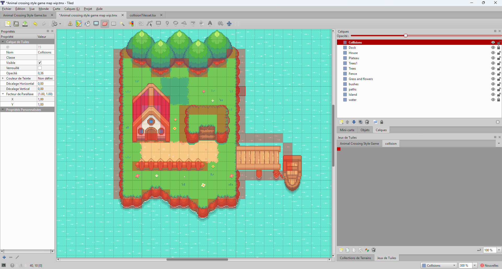
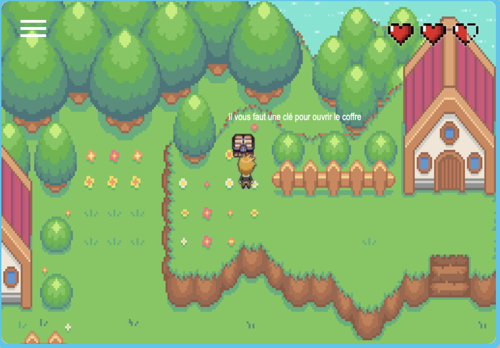
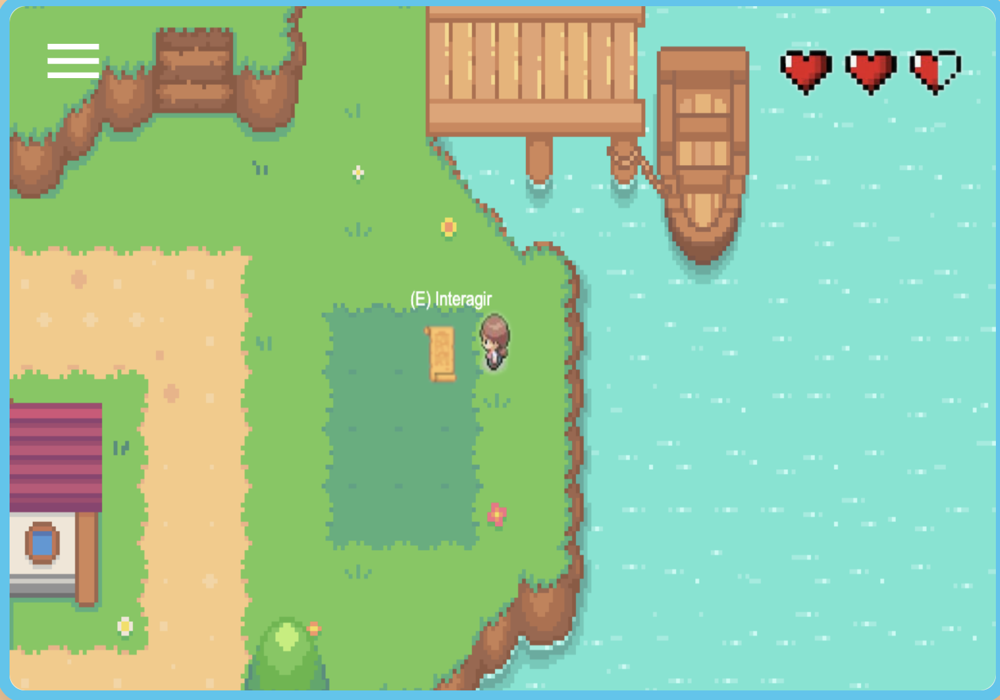
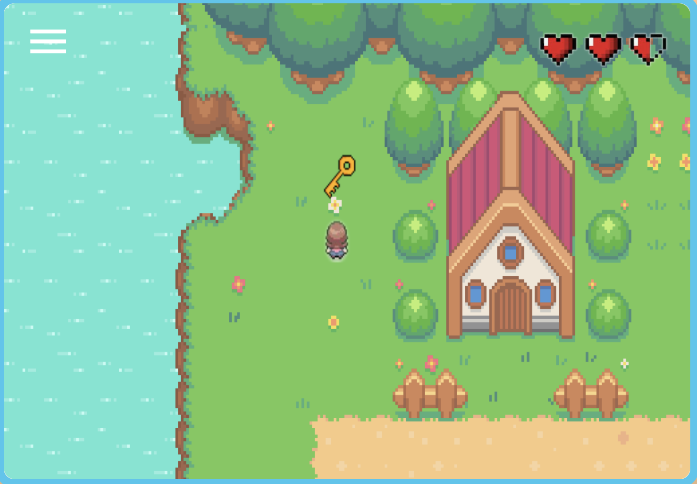

# 🎮 Portfolio RPG – Mon portfolio interactif

> Découvrez mon portfolio de manière originale : un **jeu web interactif de type RPG**, inspiré des classiques comme Pokémon et Secret of Mana.  
> Chaque interaction permet de découvrir mon **CV, ma lettre de motivation et mes coordonnées**.

---

## 📖 À propos

Ce projet est un **portfolio interactif sous forme de RPG web**.  
Le joueur explore une carte, interagit avec des objets et découvre **mes informations professionnelles** de manière ludique :  

- **Clé** → ouvre le **coffre** donnant accès au **CV et coordonnées**  
- **Parchemin** → affiche ma **lettre de motivation**  

Le but principal était de **comprendre en profondeur JavaScript**, la gestion de collisions, le déplacement des éléments DOM et l’interactivité avancée.

---

## 🕹️ Gameplay et fonctionnalités

### 🗺️ Exploration
- Choix du **personnage homme ou femme**.  
- Déplacement fluide sur la carte : le **personnage reste fixe**, c’est le décor qui bouge autour, donnant l’illusion de mouvement.  
- Gestion des **collisions avec le décor et les objets** grâce à un fichier JSON.

### 🎯 Interactions
- **Clé** → ouvre le coffre avec le CV et coordonnées.  
- **Parchemin** → affiche la lettre de motivation.  
- **Superpositions et overlays** : objets et toits passent devant ou derrière le personnage selon la perspective.  
- **Fenêtres interactives et hovers** pour un rendu dynamique.

### 🎨 Design et ressources
- Cartes créées avec **Tiled**, exportées en JSON pour gérer collisions et objets.  
- Personnages : images libres de droits (homme et femme) pour pixel art.  
- Sons et effets : ressources libres de droits.  
- UI et overlay : combinaison de **HTML, CSS et JavaScript** pour fluidité et interactivité.

### ⚡ Défis techniques
- Synchronisation du décor, des objets et des overlays pour donner l’illusion de mouvement.  
- Déplacement du personnage et collision avec le décor.  
- Gestion dynamique des fenêtres interactives (CV, lettre de motivation).  
- Interactivité avancée avec hovers, objets cliquables et animation de la carte.

---

### 📊 Système de collisions et JSON

Le jeu est **data-driven**, ce qui signifie que la logique et le contenu de la map sont séparés.  
Pour gérer les collisions, les objets et la disposition des éléments, j’ai utilisé les **fichiers JSON exportés depuis Tiled**.

- **JSON (JavaScript Object Notation)** est un format léger et lisible qui stocke des informations structurées, comme les coordonnées des tiles, des objets et les zones de collision.
- Pour simplifier l’utilisation dans le code, j’ai **isolé la partie des collisions** du fichier JSON et je l’ai transformée en **variable JavaScript** (`collisions.js`), directement exploitable dans mon `index.js`.
- Dans le code principal, j’ai utilisé cette variable et, lorsque nécessaire, j’ai appliqué `.slice()` pour ne prendre qu’une portion précise de la data correspondant à la zone de jeu active.
- Le code JS lit ensuite ce tableau pour **empêcher le déplacement du personnage sur les zones bloquées**, tout en déplaçant le décor autour du personnage pour créer l’illusion de mouvement.
- Les objets interactifs (clé, coffre, parchemin) sont également positionnés en fonction des coordonnées provenant du JSON.

> Cette approche permet de **séparer les données de la logique**, de tester facilement des portions de la map et de rendre le jeu **modulaire, extensible et maintenable**.

---

## 🖼️ Aperçu du jeu

### 🌅 Écran de démarrage

  

### 🗺️ Carte principale

  
  

### 🎮 In Game

  

    
    
In game 1

  

  

    
    
In game 2

  

  

    
    
In game 3

  

### 🧰 Objets et interactions

  

    
    
<strong>Clé</strong>

  

  

    
    
<strong>Coffre</strong>

  

  

    
    
<strong>Parchemin</strong>

  

### 🧍 Personnages jouables

  

    
    
<strong>Personnage masculin</strong>

  

  

    
    
<strong>Personnage féminin</strong>

  

---

## 🛠️ Stack technique

- **Langages** : HTML5, CSS3, JavaScript Vanilla  
- **Outils** : Tiled (création des cartes), Piskel (pixel art)  
- **Data** : JSON pour collisions et objets interactifs  
- **UI / Design** : CSS + JS pour overlays, fenêtres interactives et hovers  

Tout a été développé **de A à Z**, incluant la logique de déplacement, les collisions, les objets et la synchronisation du décor.

---

## 🚀 Améliorations prévues (V2)
- Ajouter **musique et effets sonores avec loops et fondus**  
- Plus de **personnages et PNJ interactifs**  
- Nouveaux **items et inventaire**  
- Étendre la **carte et les lieux explorables**  
- Optimisation pour plus de **fluidité et performance**  

---

## 🎓 Compétences développées

### Hard Skills
- ✅ JavaScript avancé et manipulation du DOM  
- ✅ Gestion des collisions et mouvements synchronisés  
- ✅ Data-driven design avec JSON  
- ✅ Création de cartes interactives et overlays  
- ✅ Intégration HTML / CSS / JS pour un rendu web fluide et interactif  

### Soft Skills
- 🤝 Autonomie et résolution de problèmes  
- 🎯 Créativité et conception interactive  
- 📚 Apprentissage par projet et amélioration continue  

---

## 👨‍💻 Auteur

**Charlie Wanlin**  
- 💼 Formation : Développeur Web et Web Mobile (DWWM)  
- 📧 Email : charliewanlin.pro@gmail.com
- 💼 LinkedIn : [Charlie Wanlin](https://www.linkedin.com/in/charlieWanlin/)

---

## 📄 Licence

Ce projet est **open source** et peut être utilisé à des fins pédagogiques.  
Licence MIT - voir le fichier [LICENSE](LICENSE).

---

## 🙏 Remerciements

- 🖼️ Ressources graphiques et sonores issues de **Pixabay** (libres de droits)
- 📺 Vidéos et tutoriels utilisés depuis **YouTube** pour l’apprentissage
- 🛠️ Cartes et sprites créés à l’aide de **Tiled** et **Piskel**

---

⭐ **Découvrez mon portfolio d’une manière originale et interactive !**
