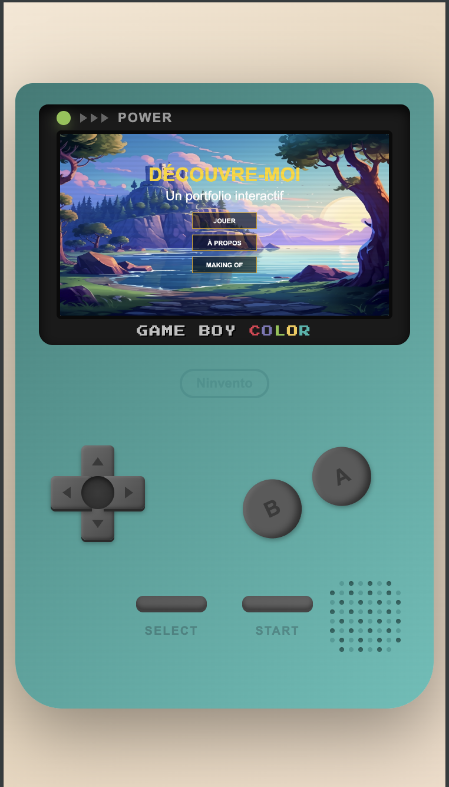
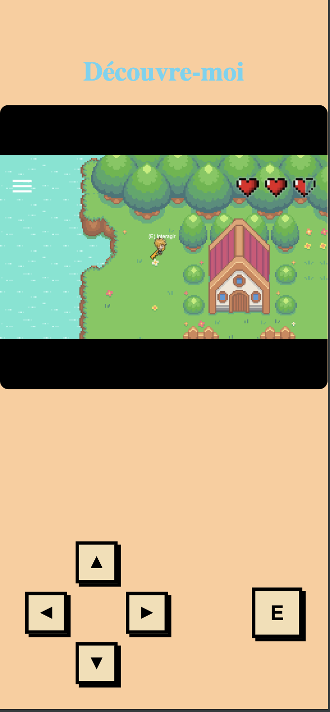
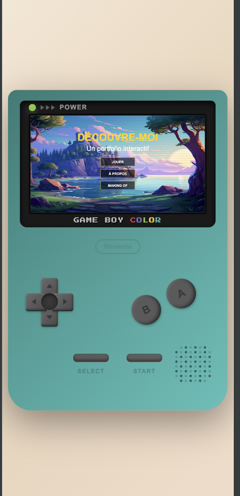
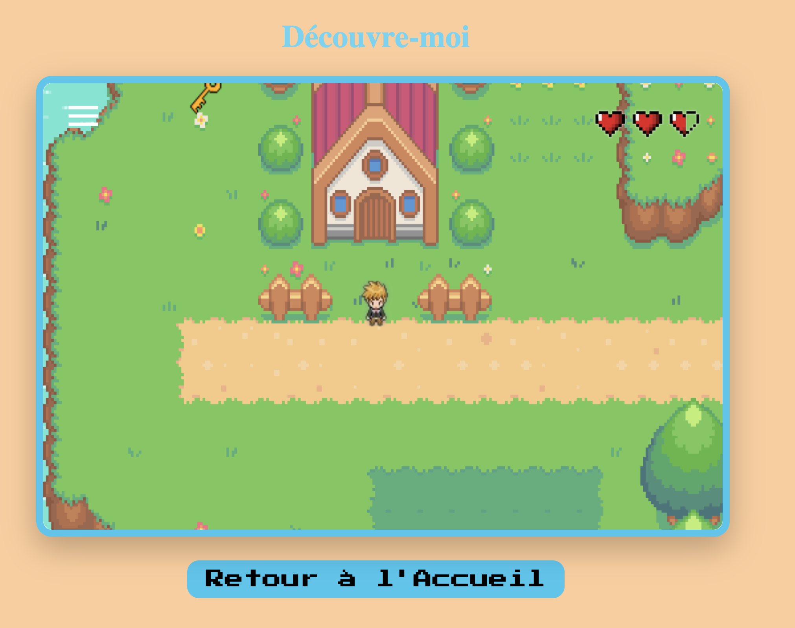
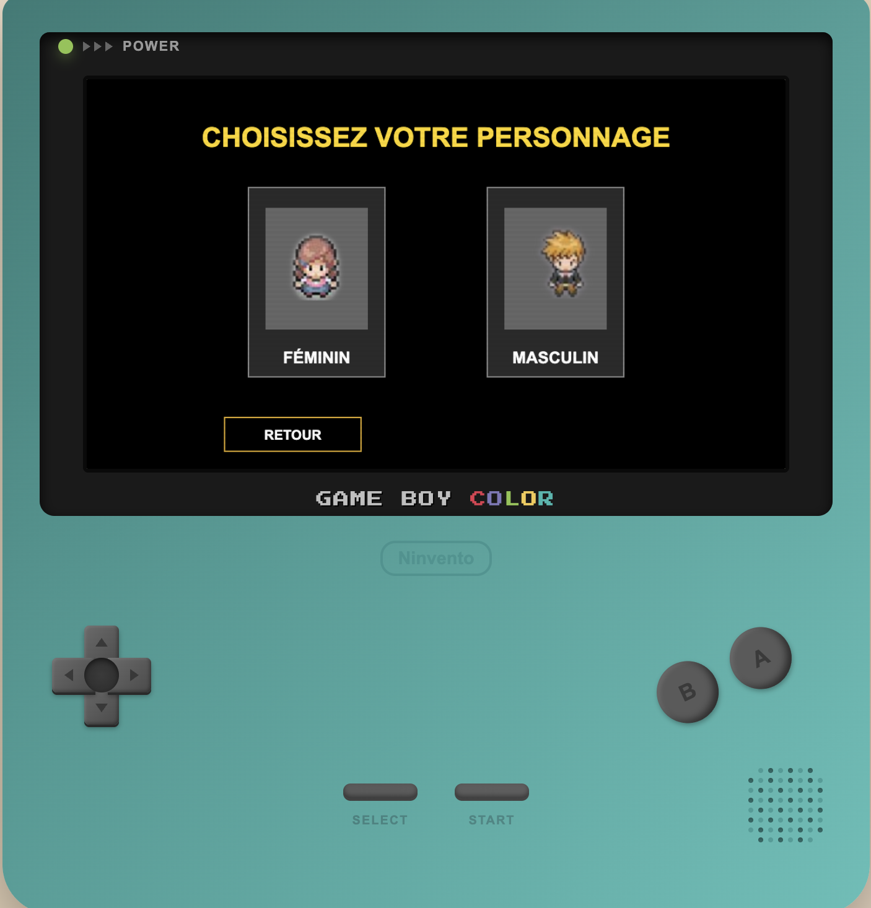
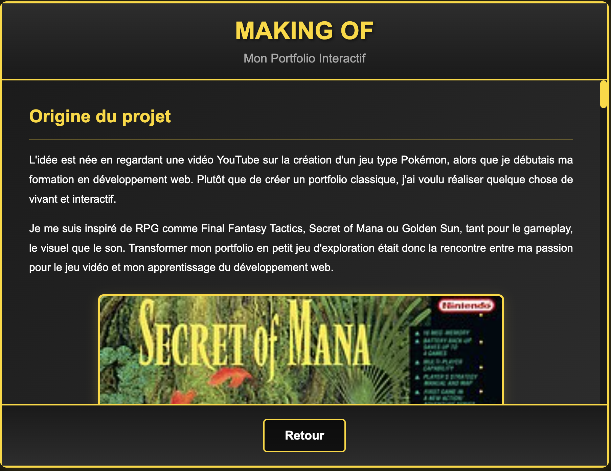
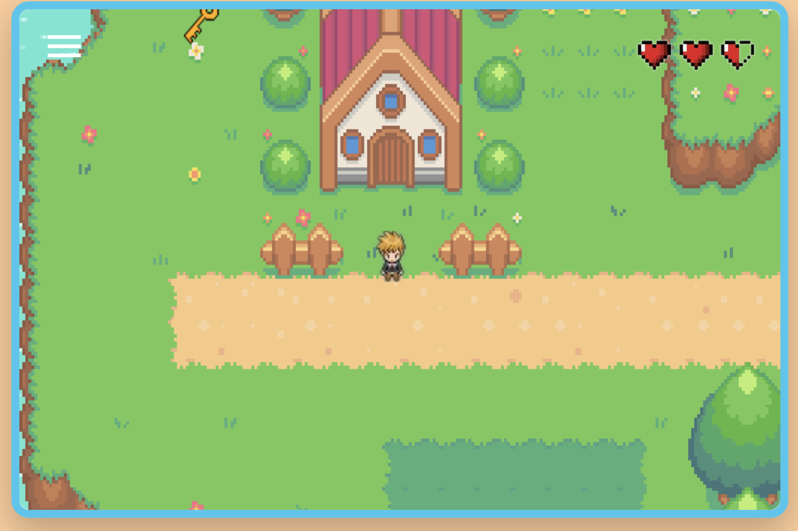
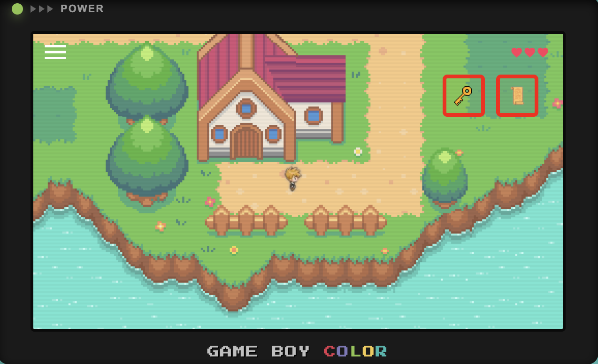

# Interactive RPG Portfolio

**Portfolio interactif sous forme de mini-jeu RPG développé en HTML, CSS et JavaScript pur.**

<p align="center">
  
</p>

<p align="center">
  <a href="https://charliewanlin.github.io/portfolioGame/"><strong>Jouer maintenant</strong></a> •
  <a href="https://github.com/charlieWanlin/portfolioGame.git"><strong>Code source</strong></a>
</p>

---

## Concept

Explorez mon parcours professionnel à travers une aventure RPG old-school ! Déplacez-vous sur une map interactive, discutez avec des PNJ pour découvrir mes compétences, récupérez des objets représentant mes projets et plongez dans une expérience ludique qui transforme le portfolio classique en véritable jeu vidéo.

**Une alternative originale au CV traditionnel**, développée entièrement from scratch pour démontrer mes compétences techniques tout en proposant quelque chose d'unique.

---

## Évolution du Projet

### Version 1.0 → Version 2.0

<table>
<tr>
<th>Version 1.0</th>
<th>Version 2.0</th>
</tr>
<tr>
<td>

**Fonctionnalités de base**

- ✅ Déplacements du personnage
- ✅ Map simple
- ✅ Système de collisions basique
- ✅ Code en un seul fichier JS
- ✅ Son d'ambiance basique

**Limitations**

- ❌ Pas de PNJ
- ❌ Pas d'inventaire
- ❌ Pas de sons pour les items
- ❌ Pas d'items collectables
- ❌ Pas de responsive
- ❌ Pas de modules
- ❌ Pas de design Gameboy

</td>
<td>

**Fonctionnalités avancées**

- ✅ Déplacements avec animations sprite
- ✅ Maps détaillées
- ✅ Collisions optimisées (JSON)
- ✅ Architecture modulaire (ES6)
- ✅ **PNJ interactifs** avec dialogues
- ✅ **Système d'inventaire** visuel
- ✅ **Gestion audio complète** (Howler.js)
- ✅ **Ambiance sonore cohérente** et immersive
- ✅ **Effets sonores** pour items et interactions
- ✅ **Objets collectables**
- ✅ **Design Gameboy Color** en CSS
- ✅ **Responsive** (mobile/tablette/desktop)
- ✅ Menus dynamiques
- ✅ États de jeu avancés

</td>
</tr>
<tr>
<td align="center">

</td>
<td align="center">

</td>
</tr>
</table>

---

## Fonctionnalités

### Gameplay

<table>
<tr>
<td width="50%">

**Version 1.0**

- Déplacements basiques
- Map simple
- Collisions limitées

</td>
<td width="50%">

**Version 2.0**

- **Déplacements fluides** avec animations sprite 4 directions
- **Système de collisions** basé sur tilemap JSON
- **PNJ interactifs** présentant mes compétences
- **Objets collectables** représentant mes projets
- **Inventaire visuel** pour suivre la progression

</td>
</tr>
</table>

### Interface & Design

<table>
<tr>
<td width="50%">

**Version 1.0**

- Interface basique
- Pas de thème spécifique
- Desktop uniquement

</td>
<td width="50%">

**Version 2.0**

- **Style Gameboy Color** recréé en CSS
- **Responsive design** (mobile/tablette/desktop)
- **Menus dynamiques** générés en JavaScript
- **Transitions fluides** entre états

</td>
</tr>
<tr>
<td align="center">

</td>
<td align="center">

</td>
</tr>
</table>

### Menu & Navigation

<table>
<tr>
<td width="50%">

**Version 1.0**

- Menu basique
- Pas d'animations
- Navigation simple

</td>
<td width="50%">

**Version 2.0**

- **Menu dynamique** généré en JavaScript
- **Animations d'apparition** fluides
- **Gestion d'états** pour les interactions
- **Design cohérent** avec l'esthétique Gameboy

</td>
</tr>
<tr>
<td align="center">

</td>
<td align="center">

</td>
</tr>
</table>

### Système d'Inventaire

<table>
<tr>
<td width="50%">

**Version 1.0**

- ❌ Pas d'inventaire
- ❌ Pas d'objets collectables
- ❌ Pas de suivi de progression

</td>
<td width="50%">

**Version 2.0**

- ✅ **Inventaire visuel** complet
- ✅ **Objets collectables** avec sprites
- ✅ **Coffres interactifs**
- ✅ **Suivi de progression** dynamique

</td>
</tr>
<tr>
<td align="center">

</td>
<td align="center">

</td>
</tr>
</table>

---

## 🛠️ Stack Technique

- **HTML5**
- **CSS3** (responsive design, layouts, animations)
- **JavaScript vanilla** (DOM, logique de jeu, gestion d'états)
- **JSON** pour les données de collisions
- **Modules ES6** (import / export)
- **Howler.js** pour la gestion de l'audio

---

## 🧩 Défis Techniques Surmontés

### 1. **Système de Collisions Performant**

Optimisation d'un système de détection de collisions basé sur des données JSON sans ralentissements.

### 2. **State Management Sans Framework**

Gestion complète des états du jeu (menu, exploration, dialogue, inventaire) en vanilla JS.

### 3. **Synchronisation Audio/Animations**

Coordination entre les animations sprite, les déplacements et les déclenchements audio pour une expérience fluide.

### 4. **Responsive Gaming Interface**

Adaptation d'une interface de jeu type console portable pour tous les écrans tout en conservant le ratio et l'esthétique Gameboy.

---

## 🚀 Installation & Lancement
```bash
# Clone le projet
git clone [URL_DU_REPO]

# Accède au dossier
cd rpg-portfolio

# Lance un serveur local (au choix)
python -m http.server 8000
# ou
npx serve
# ou simplement ouvre index.html dans ton navigateur
```

Puis ouvre `http://localhost:8000` dans ton navigateur.

---

## 📚 Compétences Développées

Ce projet m'a permis de renforcer :

- La structuration d'un projet JavaScript
- L'utilisation de modules ES6
- La gestion d'états d'interface (menus, dialogues, overlays)
- L'intégration d'assets externes (audio, sprites, données JSON)
- La logique des interactions utilisateur

---

## 🎯 Roadmap

### Améliorations envisagées

- Ajout d'un système de combat ou de mini-jeux
- Nouvelles maps et personnages
- Plus d'interactions et de quêtes
- Refactorisation avec un framework ou un moteur de jeu

---

## 🎨 Crédits & Ressources

### Assets Graphiques

- **Sprites & Images** : OpenGameArt, Itch.io, Pixabay, Freepik, Google Images
- **Création/Édition de sprites** : Piskel
- **Édition d'images** : GIMP, Paint (crop, vectoriel)

### Maps & Level Design

- **Création des maps** : Tiled

### Audio

- **Musiques & Effets sonores** : OpenGameArt, YouTube
- **Audio Engine** : Howler.js

### Développement

- **Éditeur de code** : Visual Studio Code
- **Environnement** : macOS

---

## 👨‍💻 À Propos

Je suis actuellement en reconversion dans le développement web et en formation pour devenir développeur.

Ce projet représente mon niveau actuel, ma progression et ma capacité à apprendre de manière autonome sur un projet ambitieux.

Il illustre à la fois ma logique technique, ma créativité et mon envie de proposer des expériences interactives différentes.

### 📫 Contact

- **GitHub** : [charlieWanlin](https://github.com/charlieWanlin)
- **LinkedIn** : [charlieWanlin](https://www.linkedin.com/in/charliewanlin/)
- **Email** : charliewanlin.pro@gmail.com

---

<p align="center">
  Développé avec passion ❤️
</p>